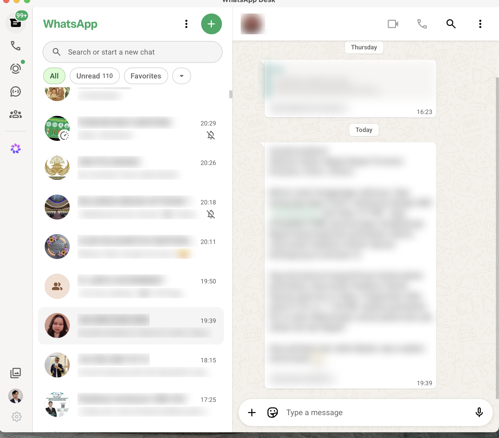
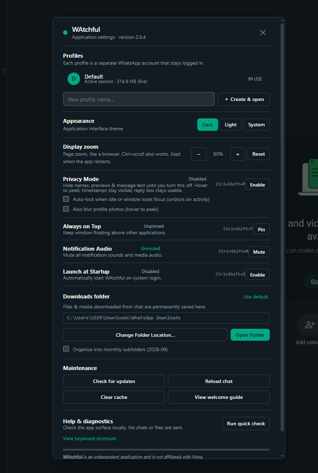

# WAtchful

[](https://github.com/latiefahmad/WAtchful/releases/latest)
[](https://github.com/latiefahmad/WAtchful/actions/workflows/build.yml)
[](https://github.com/latiefahmad/WAtchful/actions/workflows/smoke.yml)
[](https://github.com/latiefahmad/WAtchful/releases)
[](LICENSE)

WAtchful is a small desktop wrapper for the official WhatsApp Web. It uses the web engine already provided by each operating system: WebKit on macOS, WebView2 on Windows, and WebKitGTK on Linux.

## Application preview

<p align="center">
  
</p>

<p align="center">
  
</p>

The screenshots use blurred chat content to protect personal information.

## Download

**[Download the latest release →](https://github.com/latiefahmad/WAtchful/releases/latest)** — the page detects your OS and highlights the right file.

Latest published release: **v2.0.4** ([release notes](https://github.com/latiefahmad/WAtchful/releases/tag/v2.0.4))

| Platform | Download |
| --- | --- |
| macOS, Apple Silicon and Intel | [DMG](https://github.com/latiefahmad/WAtchful/releases/latest/download/WAtchful-macOS-Universal.dmg) · [ZIP](https://github.com/latiefahmad/WAtchful/releases/latest/download/WAtchful-macOS-Universal.zip) |
| Windows 10/11 x64 | [EXE](https://github.com/latiefahmad/WAtchful/releases/latest/download/WAtchful.exe) · [ZIP](https://github.com/latiefahmad/WAtchful/releases/latest/download/WAtchful-Windows-x64.zip) |
| Debian/Ubuntu x64 | [DEB](https://github.com/latiefahmad/WAtchful/releases/latest/download/WAtchful-Linux-amd64.deb) · [tar.gz](https://github.com/latiefahmad/WAtchful/releases/latest/download/WAtchful-Linux-x64.tar.gz) |
| Fedora/RHEL x64 | [portable tar.gz](https://github.com/latiefahmad/WAtchful/releases/latest/download/WAtchful-Linux-x64.tar.gz) |
| Linux arm64 | [DEB](https://github.com/latiefahmad/WAtchful/releases/latest/download/WAtchful-Linux-arm64.deb) · [tar.gz](https://github.com/latiefahmad/WAtchful/releases/latest/download/WAtchful-Linux-arm64.tar.gz) |

The links above always serve the newest published release, so a permanent link never goes stale.

Linux arm64 packages are published for every release. The updater only offers an architecture-compatible package; it never substitutes an x64 build on arm64.

### Automatic updates

WAtchful checks GitHub Releases shortly after startup and then every 4 hours. When a newer version is published, an in-app banner offers the update: WAtchful downloads the asset built for your OS and architecture, installs it, and restarts itself. You can also trigger the check manually from **Settings → Check for updates**. Nothing about your chats or account is sent during a check — the app only reads public release metadata from `github.com/latiefahmad/WAtchful`.

## Main features

- Persistent WhatsApp Web session.
- Multi-account profiles: keep several WhatsApp accounts logged in at once, each with its own isolated browser session (switch from Settings → Profiles, the tray/status menu profile switcher, or launch with `--profile <name>`).
- Preview for PDF, Word, Excel, PowerPoint, CSV, and text files.
- Reopens files already downloaded without fetching them again.
- Configurable download folder.
- Privacy mode, always-on-top, audio mute, zoom, and theme controls.
- Native menus, notifications, and automatic update checks.
- Universal macOS build and portable Windows build.

RAM and CPU usage depend on the operating system, active chats, calls, media, and the web engine version.

## Installation

### macOS

1. Open the DMG.
2. Drag **WAtchful** into **Applications**.
3. If macOS blocks the first launch, right-click the app and choose **Open**.

The macOS build supports Apple Silicon and Intel. Camera and microphone permission will be requested only when needed.

### Windows

Download and run `WAtchful.exe`. Microsoft Edge WebView2 is required and is normally already installed on current Windows 10 and Windows 11 systems. The app opens as a normal desktop window — double-clicking the executable never opens a console/terminal window alongside it.

If SmartScreen appears, review the publisher warning, choose **More info**, and continue only if the file came from this repository's release page.

### Debian/Ubuntu

```bash
sudo dpkg -i WAtchful-Linux-amd64.deb
sudo apt-get install -f
```

The portable archive requires GTK 3 and WebKitGTK 4.0 or 4.1.

## Shortcuts

| Action | macOS | Windows/Linux |
| --- | --- | --- |
| Settings | `Cmd + ,` | `Ctrl + ,` |
| Privacy mode | `Cmd + Shift + P` | `Ctrl + Shift + P` |
| Always on top | `Cmd + Shift + T` | `Ctrl + Shift + T` |
| Mute audio | `Cmd + Shift + M` | `Ctrl + Shift + M` |
| Open downloads | `Cmd + Shift + D` | `Ctrl + Shift + D` |
| Check updates | `Cmd + Shift + U` | `Ctrl + Shift + U` |
| Hard refresh | `Cmd + Shift + R` | `Ctrl + Shift + R` |
| Startup (launch at login) | `Cmd + Shift + S` | `Ctrl + Shift + S` |
| Help & onboarding | `Cmd + Shift + H` | `Ctrl + Shift + H` |

## Privacy

WAtchful loads `https://web.whatsapp.com` directly. Session and cache data remain inside the application's local profile. The application does not add an analytics service or a message relay server.

Errors and crash logs stay on your machine. Nothing is ever uploaded automatically: the Control Center's Report button (or the post-crash nudge) only opens a pre-filled GitHub issue in your browser, which you review before submitting.

Default data locations (settings, profile registry, logs):

- macOS: `~/Library/Application Support/WAtchful/`
- Windows: `%APPDATA%\WAtchful\`
- Linux: `~/.config/WAtchful/`

Inside, the Default profile keeps its session in `UserData/`, and every other profile gets an isolated folder under `Profiles/<profile>/`. Installs upgraded from older versions keep using their existing `WhatsAppDesk/` folder, so no session is lost.

## Version 2.0.4

- The WebView2 child working-set trim now runs at most once per 10 minutes, so alt-tabbing no longer causes a CPU + disk spike on every switch — verified flat head-to-head against upstream.

## Version 2.0.3

- Hiding the window for 5 seconds now also trims the WebView2 renderer/GPU/utility working sets, not just the Go process — freed pages leave RAM immediately and fault back on use.
- The tab strip shows the running build (`v2.0.3`) at its right edge, so screenshots and bug reports always identify the version.

## Version 2.0.2

- The active tab's renderer is now recycled every 90 minutes (was 6 hours), so single-account setups — which never hibernate — also get WhatsApp Web's ~1 GB baseline back to ~100–150 MB automatically.
- Leaner Windows engine flags: unused media-key/media-session services and built-in extension background pages are disabled, and hiding the window now triggers a real JS heap collection.

## Version 2.0.1

- The active tab's renderer is recycled in place after long sessions, capping WhatsApp Web's RAM growth (~0.7–0.9 GB after an hour of use → back to ~100–150 MB, session preserved).
- Rebuild waits when a download is in flight or an in-app document preview is open, so no activity is ever interrupted.

## Version 2.0.0

- Settings opens reliably again with `Ctrl+,` / `Cmd+,` on every platform, and the Profiles card always appears inside the modal.
- Profiles UI script is wired into the page init script in the correct order, with a regression test locking the sequence.
- The download dedup index is capped so long sessions no longer grow memory without bound.
- Shortcut reference in Help & diagnostics now covers `Ctrl/Cmd + Shift + S` (startup) and `Ctrl/Cmd + Shift + H` (Help & onboarding).
- First release published from this repository, with installers built by CI for macOS (universal), Windows x64, and Linux x64/arm64 ([release notes](https://github.com/latiefahmad/WAtchful/releases/tag/v2.0.0)).
- Cross-platform release build fixed end to end: the vendored webview profiles patch now compiles on Linux and macOS (cgo symbol resolution, Objective-C class ordering, duplicate-symbol cleanup), and Windows packaging works on CI runners.
- The CDP smoke test that sends a real `Ctrl+,` key event into a real Chromium engine runs automatically on pull requests that touch the init script or platform integration files.

## License and disclaimer

Licensed under the [MIT License](LICENSE).

This is an independent project and is not affiliated with, authorized by, or endorsed by WhatsApp or Meta Platforms, Inc. WhatsApp is a trademark of its respective owner.
